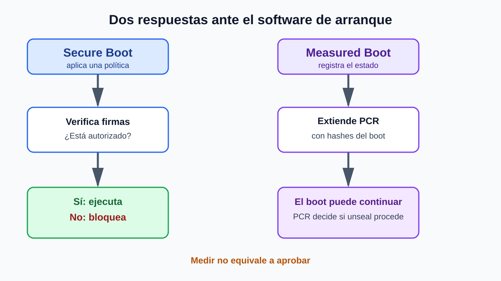
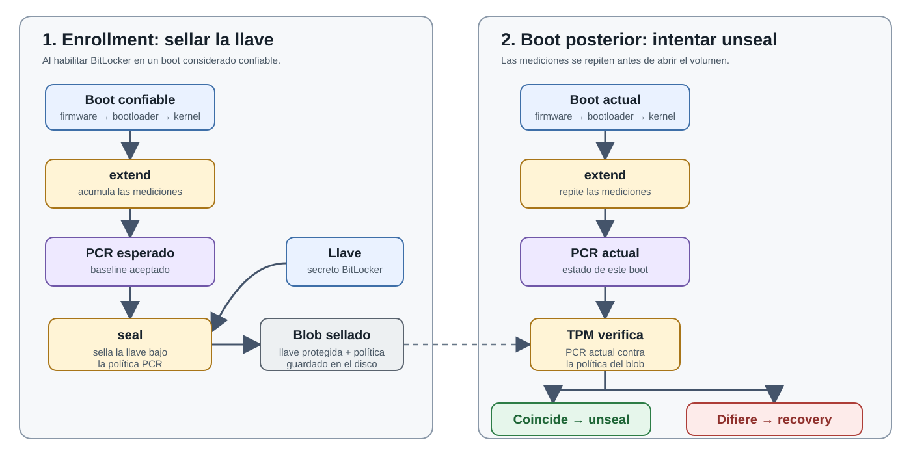
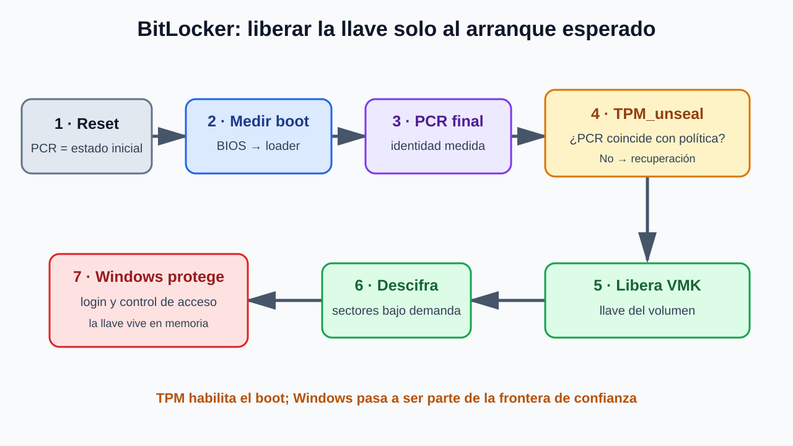
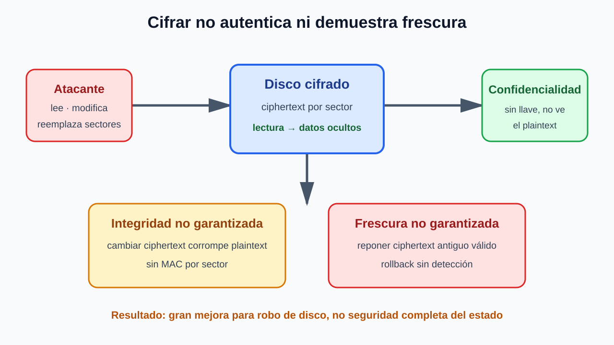

# Hardware Confiable

## BitLocker y el costo de confiar en el arranque

**Modelo:** el adversario tiene control físico parcial de la computadora.

---

# En la clase de hoy

1. Amenaza y límites del cifrado ordinario
   - Entender por qué el acceso físico convierte el cifrado en un problema de custodia de llaves.
2. Secure Boot versus Measured Boot
   - Comparar bloquear software no autorizado con registrar qué software fue ejecutado.
3. Hardware confiable y liberación de llaves de BitLocker
   - Comprender cómo el estado medido del arranque condiciona la entrega de la llave.
4. Lo que BitLocker no garantiza
   - Delimitar la protección obtenida e identificar los ataques que permanecen.

---

<!-- _class: lead -->

# Threat model y por qué el cifrado ordinario no basta

---

# ¿Qué es BitLocker?

**BitLocker es el sistema de cifrado de volumen completo de Windows.**

- Cifra los sectores del volumen donde están Windows, las aplicaciones y los datos.
- Sin la llave correcta, copiar o extraer el disco solo entrega texto cifrado.
- Durante un arranque legítimo, Windows necesita recuperar la llave para abrir el volumen.
- La llave puede protegerse mediante hardware confiable, PIN, llave USB o una clave de recuperación.

**Foco de esta clase:** cómo hardware confiable puede liberar la llave automáticamente sin almacenarla en texto claro junto al disco.

---

# El Problema: Un laptop robado

**El atacante tiene acceso físico a la máquina.**

Puede:
- extraer el disco y conectarlo a otro computador;
- arrancar desde otro medio y evitar el login de Windows;
- reemplazar componentes del boot para ejecutar su propio software.

> **Objetivo de BitLocker:** mantener confidenciales los datos almacenados aunque el atacante posea el laptop.

---

# Primera idea: cifrar el disco

El cifrado evita que los sectores copiados revelen directamente sus datos.

Pero todo cifrado necesita una **llave de desencriptación**:
- si la llave está legible en el disco, el atacante obtiene ambos;
- si nunca está disponible, Windows tampoco puede arrancar;
- si se libera durante el boot, importa **quién la recibe**.

> El problema difícil no es cifrar: es custodiar y liberar la llave.

---

# ¿Quién debería proporcionar la llave?

**Contraseña antes del boot**
- Requiere interacción temprana y puede duplicar el login de Windows.
- Una contraseña humana puede ser vulnerable a adivinación.

**Llave en USB**
- Separa la llave del disco, pero agrega un objeto que transportar.
- Puede perderse o ser robada junto con el laptop.

**Liberación automática**
- Mejora la usabilidad.
- Es peligrosa si cualquier sistema operativo puede obtener la llave.

---

# Liberación automática: el problema

BitLocker quiere abrir el volumen sin pedir una contraseña adicional ni una llave USB.

Eso significa que la computadora debe obtener la llave por sí sola durante el arranque.

Pero la liberación no puede ser incondicional:
- un atacante podría modificar el software de arranque;
- ese software pediría la llave igual que Windows;
- con la llave, podría desencriptar todo el volumen.

> La liberación automática necesita una condición de seguridad.

---

# La condición: el estado del arranque

La llave queda asociada a una configuración específica del proceso de boot.

- **Arranque esperado:** la configuración coincide y la llave puede liberarse.
- **Arranque modificado:** la configuración no coincide y la llave permanece protegida.

Un componente de hardware confiable debe observar el arranque y aplicar esta condición, porque el disco y su software pueden haber sido modificados por el atacante.

**Para aplicar esta condición, el hardware necesita controlar o registrar qué software participa en el arranque.**

- Secure Boot intenta impedir un arranque no autorizado.
- Measured Boot registra el arranque que efectivamente ocurrió.

---

<!-- _class: lead -->

# Secure Boot versus Measured Boot

---

# Secure Boot: impedir lo no autorizado

1. Código inicial inmutable (ROM/firmware) contiene una llave pública.
2. Verifica la firma del bootloader antes de ejecutarlo.
3. El bootloader verifica el kernel.
4. El kernel autentica lo que carga después.

**Política:** una firma válida autoriza; una inválida detiene el boot.

Ejemplos: UEFI Secure Boot, consolas, iOS, Chrome OS Verified Boot.

---

# Autenticar mucho código, sin leerlo todo

**Problema:** verificar de una vez toda la imagen del OS es costoso.

- Firma de una **raíz Merkle**: cada bloque trae una prueba verificable cuando se lee.
- BitLocker elige una garantía más débil para el volumen cambiante: cifra sectores y confía en que la corrupción útil sea difícil.

**Desafío común — rollback:** firmware sin estado puede aceptar una versión antigua firmada pero vulnerable. Un contador monotónico puede registrar la versión mínima permitida.

---

# Measured Boot necesita hardware confiable

**TPM significa Trusted Platform Module.**

Es un componente de seguridad pequeño, aislado del sistema operativo y del almacenamiento principal:

- mantiene registros protegidos para acumular mediciones del arranque;
- protege llaves y otros secretos;
- ejecuta operaciones criptográficas limitadas;
- aplica políticas antes de liberar secretos.

El TPM no decide si un programa es “seguro”: conserva evidencia confiable sobre lo que ocurrió durante el boot.

---

# Measured Boot: registrar, no bloquear

- Cada etapa hashea la siguiente **antes** de ejecutarla.
- El TPM acumula esas mediciones en registros protegidos llamados **Platform Configuration Registers (PCR)**.
- Software distinto produce, con alta probabilidad, un estado PCR distinto.
- El boot puede continuar aunque el estado no sea el esperado.

**Corrección clave:** las mediciones no generan una llave nueva. Los PCR **condicionan el unseal de un secreto ya sellado**.

---

# Dos mecanismos, dos decisiones

---

# ¿Qué permite y qué no permite medir?

**Permite**
- Condicionar secretos al estado de arranque.
- Reportar mediciones a un tercero mediante attestation.
- Separar “software observado” de “software autorizado”.

**No garantiza por sí solo**
- que el software medido sea seguro;
- que no tenga bugs explotables después;
- que CPU, TPM y su enlace no hayan sido manipulados.

---

<!-- _class: lead -->
# Operaciones TPM y liberación de llaves de BitLocker

---

# TPM: estado pequeño, operaciones precisas

**Dentro del TPM**
- PCR efímeros: `PCR0`, `PCR1`, …
- Llaves secretas protegidas por el TPM.

**Operaciones relevantes**
- `extend(n,m)`: `PCRn ← H(PCRn ∥ m)`
- `seal(PCR esperado, secreto)`: produce ciphertext ligado a una política.
- `unseal(ciphertext)`: libera el secreto solo si el PCR satisface la política.
- `quote(n, nonce)`: firma PCR + desafío para attestation.

---

# Cuatro operaciones, cuatro propósitos

- **`extend`** → registra la secuencia del arranque.
- **`seal`** → vincula un secreto a un estado PCR esperado.
- **`unseal`** → libera el secreto cuando el estado actual satisface la política.
- **`quote`** → entrega a otra parte evidencia firmada sobre los PCR.

**Para BitLocker:** `extend` registra el boot; `seal` y `unseal` protegen la llave. `quote` se usa principalmente para attestation.

---

# Cadena de medición

1. Al reset, CPU y TPM deben reiniciarse juntos; PCR parte de un valor conocido.
2. BIOS mide su estado y extiende el PCR.
3. BIOS carga y mide el bootloader; luego lo ejecuta.
4. Bootloader carga y mide el kernel; luego lo ejecuta.

**Supuestos delicados:** la CPU comienza en BIOS no manipulado y el atacante no desacopla el reset del TPM.

---

# Extend + seal/unseal

---

# ¿Qué prueba un PCR esperado?

Un PCR correcto es **consistente con** la cadena de software esperada, pero no una prueba absoluta:

- una etapa medida podría contener un bug explotable;
- desde esa etapa, el atacante podría emitir sus propios `extend`;
- la CPU podría no haber comenzado en el BIOS previsto;
- CPU y TPM podrían no haberse reseteado sincrónicamente.

**Lección:** el significado del PCR depende de la cadena y de supuestos de hardware.

---

# Modo TPM de BitLocker

- La llave de volumen no se guarda en claro “dentro del TPM”.
- Se almacena **sellada** bajo una política PCR.
- El TPM la libera cuando reconoce el arranque medido.
- El usuario no necesita interactuar con el firmware.

**Consecuencia:** el TPM protege la llave **hasta que termina el boot esperado**. Después de liberarla:

- Windows mantiene la llave en memoria y puede leer el volumen;
- el login y los permisos de Windows controlan quién accede a los datos;
- si un atacante compromete el kernel en ejecución, BitLocker ya no impide que lea el disco.

**BitLocker protege datos en reposo; no protege un Windows ya desbloqueado y comprometido.**

---

# Del reset al volumen Windows

---

# BitLocker con TPM, sin PIN de prearranque

**“Modo solo-TPM”** significa que el TPM es el único requisito para liberar automáticamente la llave:

1. El estado PCR coincide con la política.
2. El TPM libera la llave y Windows abre el volumen.
3. Recién entonces aparece el login de Windows.

**Ventaja:** el usuario no necesita ingresar un PIN adicional antes de iniciar Windows.

**Costo:** si el arranque pasa las comprobaciones del TPM, cualquiera con el laptop puede llegar hasta el login con el volumen ya abierto. Desde ahí, la protección depende de las credenciales y del kernel de Windows.

**TPM + PIN** agrega un segundo requisito antes de liberar la llave.

---

# ¿Qué ataques detiene el modo solo-TPM?

**Disco extraído o copiado a otro computador**
- El otro TPM no puede liberar la llave sellada.

**Boot modificado en el mismo laptop**
- Si cambian las mediciones cubiertas por la política PCR, BitLocker entra en recuperación.

**Boot normal en el mismo laptop**
- El TPM libera la llave y el atacante llega al login de Windows.

**En resumen:** protege contra lectura *offline* y cambios en el boot medido sin exigir un PIN. Si el equipo arranca normalmente, el atacante llega al login de Windows.

---

# ¿Qué se mide antes de liberar la llave?

**Ruta de arranque**
- Firmware y componentes de arranque extienden sus mediciones en los PCR.
- BitLocker vincula la liberación de la llave a ese estado PCR esperado.
- Si cambia un componente cubierto por la política, el TPM no libera la llave automáticamente.

**Volumen de Windows cifrado**
- No se calcula un hash de todo el volumen en cada arranque: es grande y cambia constantemente.
- Después de liberar la llave, Windows descifra y cifra sectores bajo demanda.

**Consecuencia:** un PCR esperado valida la ruta de arranque medida, no demuestra que cada archivo del disco permanezca intacto.

---

# Actualización y recuperación

**Si cambia la partición medida**
- Preparar la nueva política y re-sellar antes de actualizar.

**Si el PCR no coincide o el equipo falla**
- Usar una contraseña/llave de recuperación.
- Puede almacenarse administrativamente (por ejemplo, en Active Directory).

La recuperación evita perder datos, pero agrega otro secreto que debe protegerse.

---

# ¿Por qué cifrar sector por sector?

- BitLocker puede descifrar solo el sector solicitado, sin procesar el volumen completo.
- Una escritura de sector puede completarse como una sola operación.

**Agregar integridad es más difícil**

- Cada sector cifrado necesitaría además un tag de autenticación.
- Si el tag se guarda aparte, leer o escribir puede requerir I/O adicional.
- Al escribir, texto cifrado y tag deben cambiar juntos: después de un crash no puede quedar uno nuevo y el otro antiguo.

Eso es **atomicidad**: actualizar ambos por completo, o no actualizar ninguno.

---

<!-- _class: lead -->

# Lo que BitLocker no garantiza

## Integridad · rollback · DMA/cold boot · kernel comprometido

---

# Confidencialidad ≠ estado confiable

---

# Integridad: el atacante puede escribir

El cifrado oculta plaintext, pero no necesariamente detecta cambios al ciphertext.

- Secure Boot solo cubre la cadena verificada/medida.
- El volumen OS contiene datos que cambian continuamente.
- Una modificación de sector puede corromper código, configuración o datos.

**Ideal:** un MAC por sector, verificado antes de usar el plaintext.

---

# MAC por sector: costos reales

- **Sector adyacente:** casi duplica espacio y requiere dos escrituras atómicas.
- **Tabla separada:** agrega seeks/I/O y también rompe atomicidad ante fallas.
- **MAC por grupo:** reduce overhead, pero actualiza datos y autenticador por separado.
- Sectores “enterprise” de 520 bytes pueden guardar metadata; no eran opción común.

El diseño sacrifica integridad fuerte para funcionar con discos convencionales.

---

# “Autenticación del pobre”

BitLocker busca que alterar ciphertext no produzca un cambio **útil y predecible** en plaintext.

- Un paso de *shuffling* difunde cambios dentro del sector.
- Código aleatoriamente corrupto probablemente falla o levanta una excepción.
- No equivale a un MAC: corrupción y manipulación siguen sin autenticarse.

**Supuesto:** las capas superiores detectan o colapsan ante datos importantes corruptos.

---

# El peor caso: un bit decisivo

Imagine un sector donde un bit significa **“¿requiere login?”**

- El atacante prueba ciphertexts modificados.
- Observa cuándo cambia el comportamiento.
- Si la aplicación ignora la corrupción restante, puede acertar un estado útil.

---

# Rollback, DMA y cold boot

**Frescura / rollback**
- Un sector cifrado antiguo puede seguir siendo un ciphertext válido.
- BitLocker no mantiene versión autenticada por sector.

**Extracción de llave**
- DMA (por ejemplo, dispositivos de alta confianza) puede leer memoria.
- Cold boot explota remanencia de DRAM tras apagar/reiniciar.
- Atacar el enlace CPU–TPM puede observar o alterar la liberación.

---

# Matriz de garantías

| Propiedad | Resultado de BitLocker |
|---|---|
| Confidencialidad de disco robado | **Fuerte dentro del modelo** |
| Arranque esperado antes de unseal | **Condicionado por PCR y supuestos HW** |
| Integridad por sector | **No; mitigación probabilística** |
| Frescura / anti-rollback | **No** |
| Resistencia a DMA / cold boot | **No completa** |
| Kernel de Windows comprometido | **Fuera de protección** |

---

# Conclusión

- El cifrado protege el disco; el TPM ayuda a custodiar la llave.
- Secure Boot **bloquea**; Measured Boot **registra** y habilita políticas.
- PCR + `unseal` liberan un secreto existente al arranque esperado.
- BitLocker prioriza despliegue, rendimiento y uso transparente.
- El precio: integridad débil, sin frescura y exposición tras entregar la llave a Windows.

> Buen diseño de seguridad = garantía explícita + amenaza explícita + trade-off explícito.

---

<!-- _class: lead -->
# APPENDIX

## Extensiones y caminos secundarios

---

# Appendix · Attestation

`TPM_quote(PCR, nonce)` firma mediciones y un desafío fresco.

- El verificador remoto confía en la identidad del TPM.
- El fabricante certifica la llave pública asociada.
- El nonce evita reutilizar una respuesta vieja.
- El verificador compara PCR con estados aceptables.

**Diferencia:** `unseal` entrega un secreto local; attestation convence a un tercero.

---

# Appendix · Cuando el dueño no es confiable

La misma raíz de confianza sirve para políticas distintas:

- **DRM:** verificar que el cliente ejecuta software que restringe copias.
- **Cloud:** verificar VMM/bootloader antes de entregar secretos a una VM.
- **Tarjetas inteligentes / appliances:** limitar operaciones aunque el entorno sea hostil.

Aquí el dueño del dispositivo puede ser el adversario; el servicio remoto confía en el chip y las mediciones.

---

# Appendix · SGX: proteger aun del OS

- Un **enclave** crea un dominio de ejecución aislado.
- La memoria del enclave se cifra y autentica.
- Un OS no confiable manipulando esa memoria se trata como atacante físico.
- También requiere frescura para evitar reponer memoria antigua.

**Garantía más fuerte que BitLocker**, a cambio de hardware, complejidad y una superficie distinta.

---

# Appendix · Cifrado a nivel de filesystem

**Ventajas**
- El FS puede reservar espacio para MACs e IV aleatorios.
- Puede coordinar consistencia y atomicidad con su metadata.

**Desventajas**
- Mucho más código entra tarde en la cadena medida.
- Actualizaciones de FS/drivers pueden exigir nuevas políticas.
- Puede no cubrir swap/paging.
- Es más difícil desplegar incrementalmente.

---

# Appendix · Tres propiedades separadas

- **Secreto:** quien obtiene el disco no aprende los datos. BitLocker lo logra mayormente.
- **Integridad:** reemplazar datos se detecta. BitLocker depende de “autenticación del pobre”.
- **Frescura:** reponer una versión antigua se detecta. BitLocker no lo garantiza.

Separarlas evita vender “disco cifrado” como sinónimo de “disco confiable”.

---

# Appendix · Referencias

- Paper: **“BitLocker Drive Encryption”**, Microsoft.
- TPM 2.0 Library Specification — Trusted Computing Group: https://trustedcomputinggroup.org/
- Intel Software Guard Extensions: https://www.intel.com/content/www/us/en/architecture-and-technology/software-guard-extensions.html
- Chrome OS Verified Boot: https://www.chromium.org/chromium-os/chromiumos-design-docs/verified-boot
- Microsoft, Secure the Windows boot process: https://learn.microsoft.com/windows/security/
